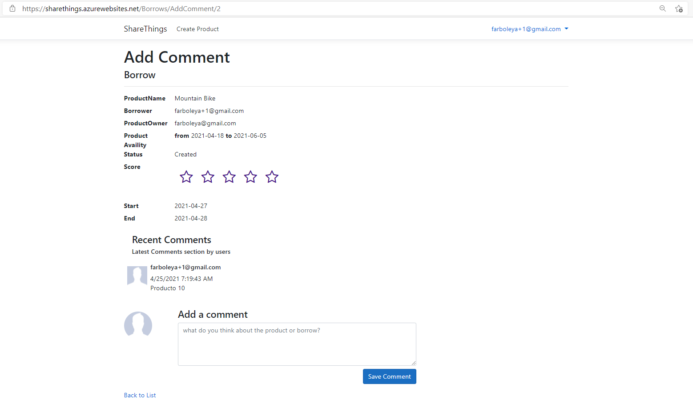

# MCA-TFM-Sharethings


**Índice**
1. [Introducción](#intro)
2. [Modelo del dominio](#domain)
3. [Stack Tecnológico](#stack)
4. [Descripción técnica del proyecto](#project)
5. [Metodología RUP](#ruplinks)
6. [Sharethings](#web)

<div id='intro' />

## Introducción
El objetivo de este proyecto es afianzar todo lo aprendido durante el curso y aunar todos los conceptos en un mínimo producto viable. 

Para ello hemos aplicado los conceptos de las siguientes asignaturas,

* Diseño y calidad software 
* Patrones y arquitectura software 
* Pruebas software 
* Seguridad por cultura 
* Pruebas de servicios de Internet 
* Arquitecturas de servicios de Internet 
* Persistencia y análisis de datos 
* Computación en la nube 
* Contenedores y orquestadores 
* DevOps 
* Repositorios y modelos de desarrollo 
* Integración y entrega continua 
* Despliegue continuo

Nos hemos apoyado como metodología principal de desarrollo en Rational Unified Process. Usando como tecnología principal Net 5 y lenguaje mayoritario C#, además de otros como Javascript, Razor y Bootstrap y SQL Server apoyado sobre el ORM Entity Framework Core para la capa de persistencia. 

Para proveer una red de seguridad a nuestro proyecto nos hemos apoyado en el framework xUnit para pruebas unitarias y funcionales.

La aplicación web desarrollada se llama ShareThings. La cual consiste en dar a las personas una herramienta para compartir productos que no utilicen en un periodo de tiempo pactado, es decir, realizar prestamos de productos entre personas de forma desinteresada.


<div id='domain' />

## Modelo del dominio


<div id='stack' />

## Stack Tecnologico

* BackEnd Framework: .Net 5
* FrontEnd Framework: 
    * Razor
    * BootStrap
    * Javascript
* BBDD: SQL Server 2019
    * ORM: Entitty Framework Core 
    * CodeFisrt Mode
* Authorization management: Identity service
* Source Control: GitHub
* Testing Framework: 
    * xUnit
    * Moq
    * TestHostServer
* Quality tool: SonarQube
* Continuous Integration: GitHub Actions
* Continuous Deployment: GitHub Actions
* Cloud Infrastructure: Azure
    * Blob Storage
    * App Service
    * SQL Database service
* Local infrastructure:
    * Docker Compose
    * IIS Express
* Third party tools: Sendgrid

<div id='project' />

## Descripción técnica del proyecto

ShareThings es una aplicación construida con .Net 5 y Entity Framework Core sobre base de datos Microsoft SQL Server. Se automatizan los flujos de trabajo sobre GitActions y se despliegue sobre Azure Cloud. 

### Arranque del proyecto

Una vez descargado el código del repositorio existen las siguientes opciones de arranque local: 
 * Recursos instalados localmente
 * Despliegue mediante Docker

#### Recursos instalados localmente

* Es necesario instalar el motor de base de datos Microsft SQL Server desde el siguiente [enlace](https://www.microsoft.com/es-es/download/details.aspx?id=55994)

* Instalación de .Net 5 desde el siguiente [enlace](https://dotnet.microsoft.com/download/visual-studio-sdks)

* Instalación del cliente Entity Framework Core
```powershell
dotnet tool install --global dotnet-ef
```
* Ejecutar los siguientes comandos para la preparación del modelo de base de datos desde la carpeta raíz
```powershell
dotnet ef migrations add InitialCreate --project .\ShareThings\ShareThings.csproj --context ShareThingsIdentityContext
```
```powershell
dotnet ef --startup-project .\ShareThings\ migrations add InitialCreate --project .\ShareThings.Data\ShareThings.Data.csproj --context ShareThingsDbContext
```
```powershell
dotnet ef database update -c ShareThingsIdentityContext
```
```powershell
dotnet ef database update -c ShareThingsDbContext
```

* Abrir el fichero ShareThings.sln desde Visual Studio y ejecutar la aplicación en IIS Express

#### Despliegue mediante Docker
* Instalación de Docker desde el siguiente [enlace](https://docs.docker.com/get-docker/)

* Ejecutar el siguiente comando desde el raíz para arrancarlo
```powershell
docker-compose -f "docker-compose.yml" up -d --build
```
* Ejecutar el siguiente comando desde el raíz para pararlo
```powershell
docker-compose -f "docker-compose.yml" down
```

### Recursos de Azure

A continuación se muestra la infraestructura desplegada en Azure Cloudd

#### Resource Group


#### Web


#### BBDD


#### Blob Storage


#### Quality


### GitHub Actions

Este sistema funciona mediante la parametrización de pasos ejecutados secuencialmente, para la parte de integración continua (CI) estos son los pasos que hemos definido:


Para la sustitución de password del entorno producción se han utilizado las Secrets de Github.

En la parte de entrega continua (CD) los definidos son estos:


Cada ocurrencia está descrita en el fichero dotnet.yaml que contiene la aplicación dentro del directorio .github/workflows.

<div id='ruplinks'>

## Metodologia RUP
* [Analisis](https://github.com/MasterCloudApps-Projects/RUP-Arquitecturas-Agiles/blob/main/RUP/Analisis.md)
* [Diseño](https://github.com/MasterCloudApps-Projects/RUP-Arquitecturas-Agiles/blob/main/RUP/Dise%C3%B1o.md)
* [Requisitos](https://github.com/MasterCloudApps-Projects/RUP-Arquitecturas-Agiles/blob/main/RUP/Requisitos.md)
* [Implementacion & Testing](https://github.com/MasterCloudApps-Projects/RUP-Arquitecturas-Agiles/blob/main/RUP/Implementacion.md)

<div id='web' />

## Sharethings

A continuacion, se puede ver el producto terminado y funcional en el que se ha basado el TFM. 

### Home

### Home - Buscador


### Creacion de producto


### Detalle de producto


### Eliminar producto


### Editar producto


### Listado de productos


### Solicitud de borrow (prestamo)


### Detalle de borrow (prestamo)


### Shary / UnShary


### Añadir comentario


### Puntuar borrow (prestamo)


### Confirmar borrow (prestamo)


### Perfil de usuario

